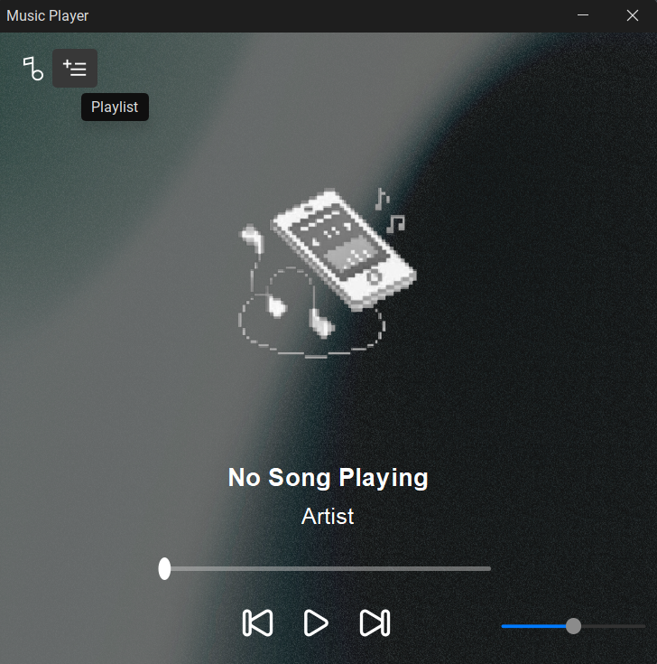
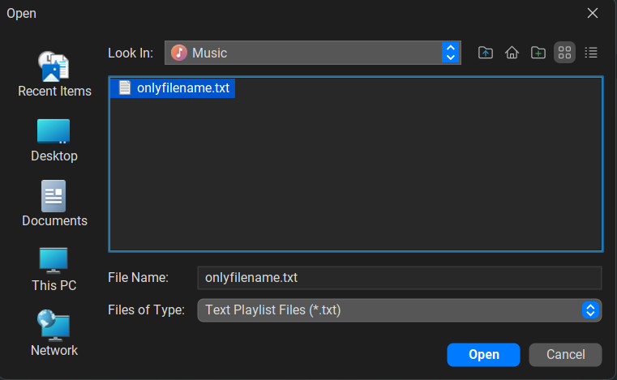
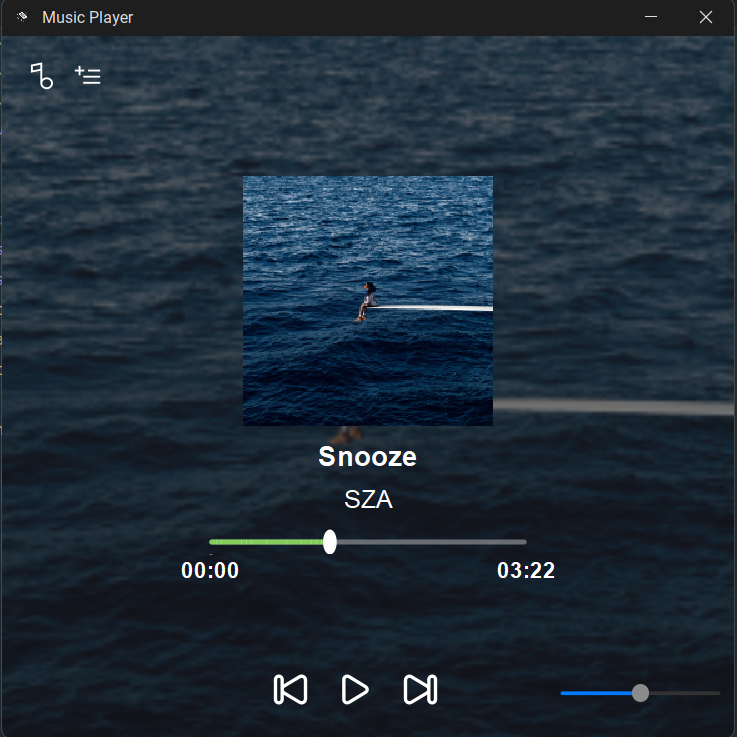
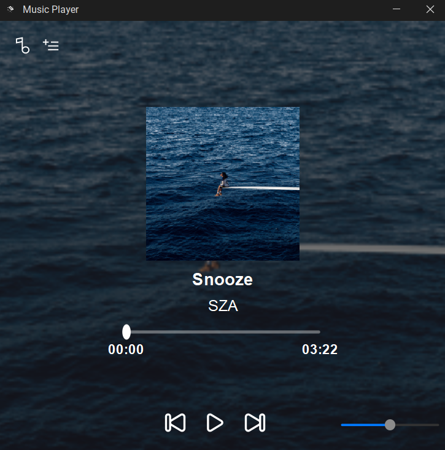
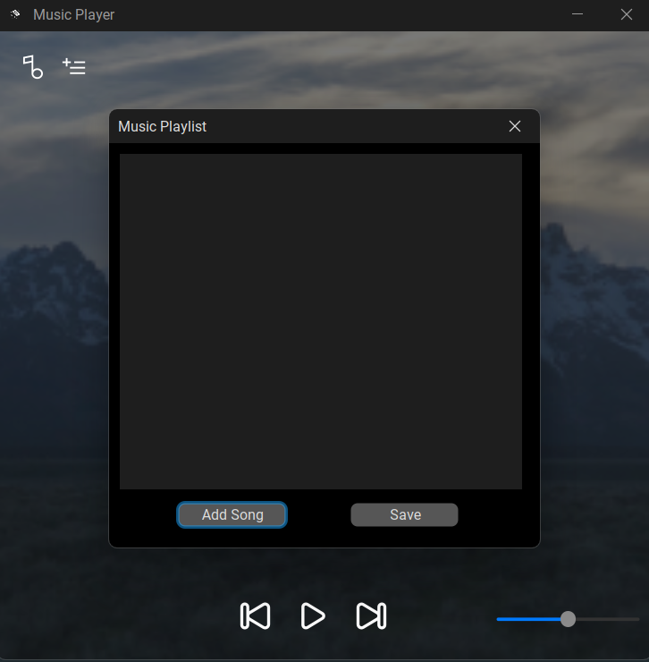
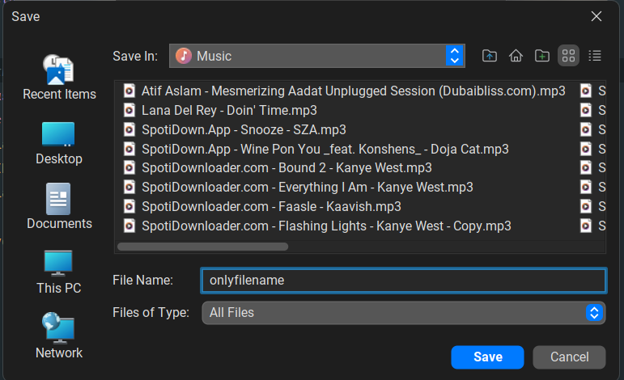
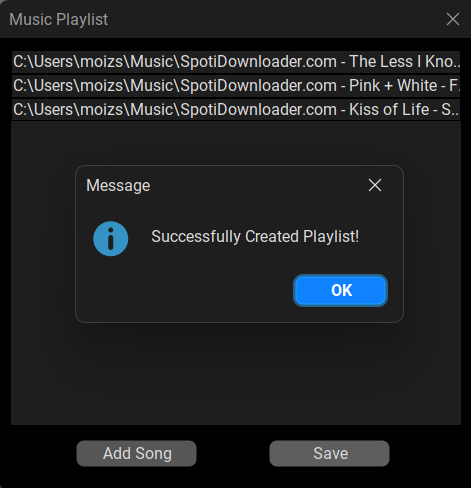
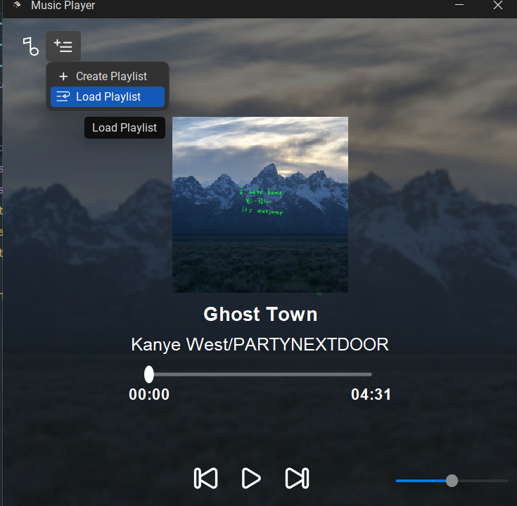
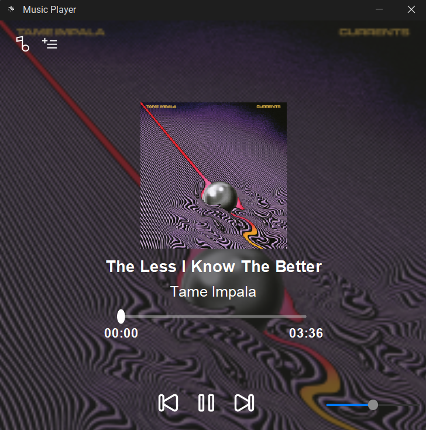

# 🎵 Music Player App

A polished Java Swing music player with a modern FlatLaf UI, customizable playlists, album art, metadata display, and a Windows installer-ready release.

---

## 🚀 Highlights

- **Modern UI**: Powered by FlatLaf and FlatLaf Extras for light/dark themes, animation, and Roboto font :contentReference[oaicite:1]{index=1}.
- **Audio Playback**: Uses BasicPlayer and JLayer to support MP3 and other formats.
- **Metadata & Tags**: Displays artist, title, album artwork via jaudiotagger and mp3agic.
- **Playlists**: Create, load, and save custom playlists as `.txt` files.
- **Release Ready**: Includes Windows `.exe` build—cross‑platform support pending.

---
## 📸 Screenshots












## ✨ Features

- Playback controls: Play ▶ Pause ⏸ Next ⏭ Previous ⏮
- Seek & volume sliders
- Album art + metadata display
- Custom, savable playlists (`.txt`)
- Modern Dark themes with Roboto font

---

## 🛠️ Tech Stack

| Component            | Library / Tool             |
|----------------------|----------------------------|
| UI                   | Java Swing + FlatLaf       |
| Audio playback       | BasicPlayer, JLayer        |
| Metadata processing  | jaudiotagger, mp3agic      |
| SVG support          | JSVG                       |
| Logging              | SLF4J                      |
| Font & themes        | FlatLaf Extras + Roboto    |
| Build system         | Maven (Java 24 target)     |


---

## 🛡️ System Requirements

- Java 24 (both compile and runtime)
- Maven build tools + internet access for dependencies

---

## ⚙️ Setup & Install

```bash
git clone https://github.com/moiz-sai/modern-music-player.git
cd modern-music-player
mvn clean package
# To run:
java -jar target/modern-music-player-1.0-SNAPSHOT.jar
```